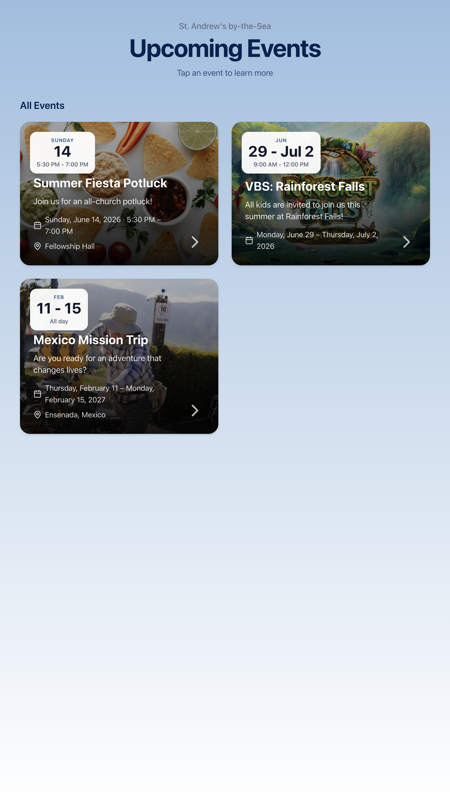
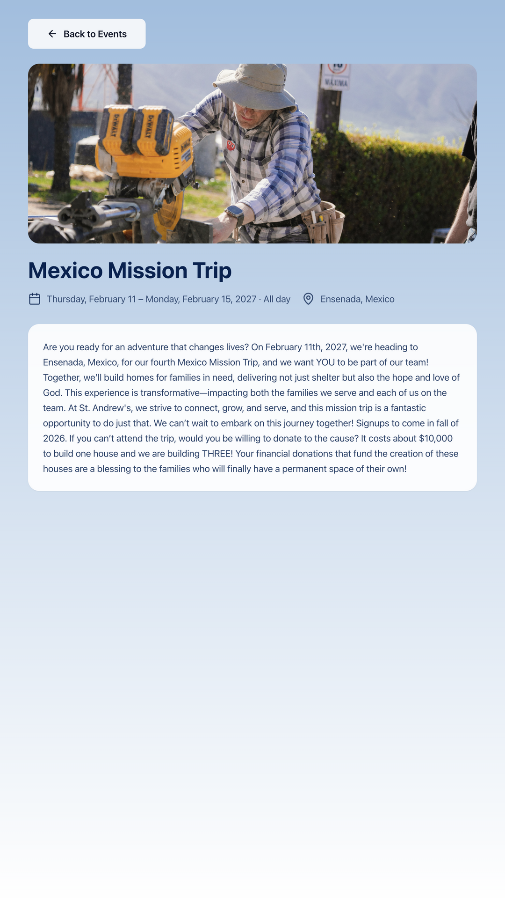

**This project generated with the use of Cursor**

# Event Kiosk

Touchscreen kiosk for church events synced from **Breeze CHMS**. Admins add images, descriptions, and registration links; visitors browse events and sign up through embedded registration sites.

Designed for **Raspberry Pi OS Lite** (no desktop required). Also runs on other Linux systems or locally for development.

<p align="center">
  
  
</p>

## Features

- Breeze CHMS calendar sync
- Touch-friendly kiosk UI for large displays
- Admin panel for events, branding, and settings
- Fullscreen Electron shell with registration domain whitelist

## Raspberry Pi (recommended)

Install from a **pre-built release package** on a fresh Pi OS Lite 64-bit image

### 1. Get the release package

Download the latest `event-kiosk-pi-*.tar.gz` from [GitHub Releases](https://github.com/Bytelake/Kiosk-Project/releases).

### 2. Install on the Pi

Extract and run the installer:

```bash
tar -xzf event-kiosk-pi-*.tar.gz && cd event-kiosk-pi-*
sudo bash install.sh
```

Set your admin password:

```bash
sudo nano /var/lib/kiosk/.env
sudo systemctl restart kiosk-web
```

Admin webpage: `http://<ip-of-kiosk>:3000/admin`

For rotated monitors: `sudo bash install.sh --rotation left`

### Updates

Download a newer release package, copy it to the Pi, extract, and run `sudo bash update.sh` (not `install.sh`). Application code lives in `/opt/kiosk`; your database, uploads, and config live in `/var/lib/kiosk`. 

To uninstall, run `sudo bash /opt/kiosk/uninstall.sh` or press **Ctrl+Alt+F2**.

## Development

Requires Node.js 20.9+.

```bash
npm install
cp apps/web/.env.example apps/web/.env
npm run db:push --workspace=web
npm run db:seed --workspace=web
npm run dev
```

Optional Electron shell: `npm run dev:shell`

### Desktop dev mode

For local development with a normal mouse, keyboard, visible cursor, and a portrait 9:16 Electron window (matching vertical kiosk orientation):

```bash
npm run dev:desktop
```

This starts the Next.js dev server and Electron shell together. Admin is still available in your browser at http://localhost:3000/admin.

Alternatively, set `KIOSK_DESKTOP_MODE=true` in `apps/web/.env` for web-only desktop behavior (visible cursor, no idle redirect) when using `npm run dev` without the shell.

Desktop mode disables hidden cursor styling and the 60-second idle redirect on event detail pages. Production kiosk behavior is unchanged when the flag is unset or `false`.

#### Screenshots for docs

While `dev:desktop` is running, navigate to the kiosk screen you want, then press **Cmd+Shift+S** (Mac) or **Ctrl+Shift+S** (Linux/Windows). This saves an exact **1080×1920** PNG to `screenshots/` at the repo root (e.g. `kiosk-home-20250608-143022.png`). The shortcut is ignored while a registration overlay is open.

| URL | Purpose |
|-----|---------|
| http://localhost:3000/kiosk | Preview Kiosk UI |
| http://localhost:3000/admin | Admin panel (default password: `changeme`) |

### Environment variables

Copy `apps/web/.env.example` to `apps/web/.env`. Required: `ADMIN_PASSWORD`, `SESSION_SECRET`. Set `COOKIE_SECURE=false` when using HTTP on a Pi. Set `KIOSK_DESKTOP_MODE=true` for local desktop dev (see above).

Breeze credentials can go in `.env` or Admin → Settings.

## Other Linux systems

For Ubuntu, Pi OS Desktop, or any system with X11:

1. Copy the project to `/opt/kiosk`
2. Install Node.js 20+, run `npm install`, build the web and shell apps
3. Configure `/opt/kiosk/apps/web/.env`
4. Run `sudo bash deploy/linux/lockdown.sh`
5. Start services: `sudo systemctl start kiosk-web kiosk-shell`

This path uses X11 (`kiosk-shell.service`). Pi OS Lite uses Wayland/cage instead — use the Pi package installer above.

## Breeze setup

1. In Breeze: **Account → API** — copy subdomain and API key
2. In admin **Settings**, enter credentials and select calendars
3. **Sync Now**, then edit events and publish

Breeze-owned fields (title, date) update on sync. Admin-added content is preserved.

## Project structure

```
apps/web/           Next.js kiosk UI, admin, API, Breeze sync
apps/shell/         Electron kiosk shell
deploy/pi-os-lite/  Pi release packaging and installer scripts
deploy/linux/       Generic Linux systemd setup
scripts/            Build scripts
```

## License

Private — for organization use.
