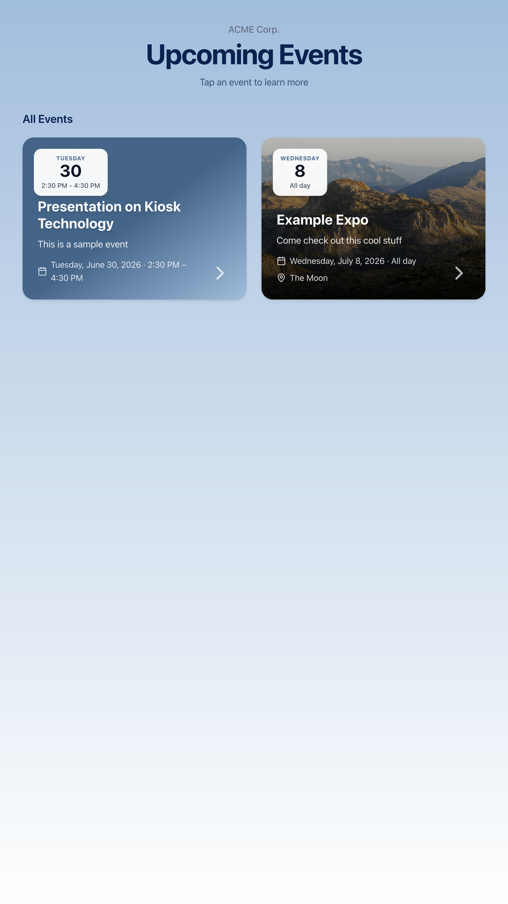
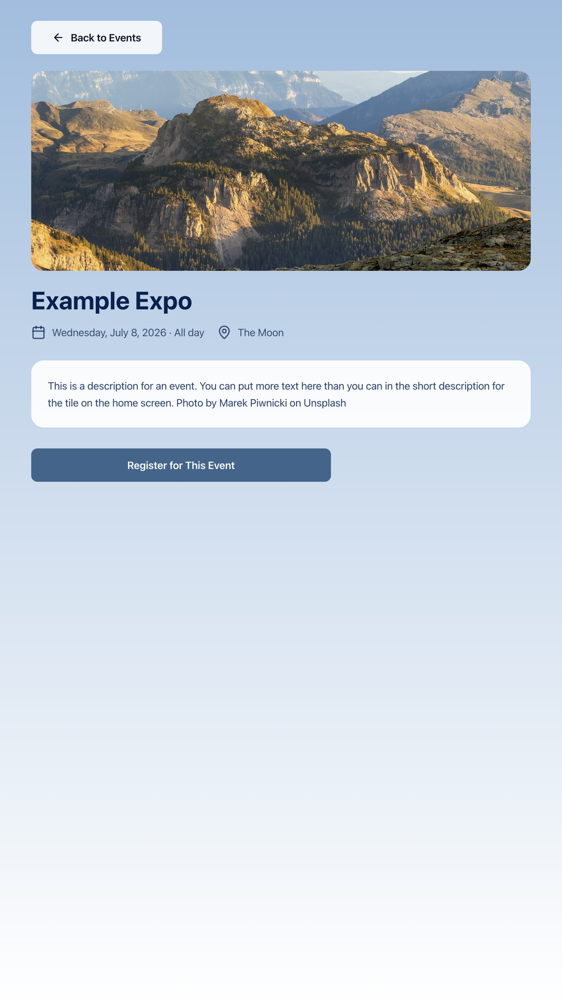

**This project generated with the use of Cursor. Use at your own risk**

# Event Kiosk

Free, self-hosted touchscreen software for listing events. Visitors browse on a display and sign up through any registration site you allow. Admins add images, descriptions, and links; optional sync from **Breeze CHMS**.

Runs on **Debian/Ubuntu** (including Raspberry Pi OS) and **Alpine Linux**. Also runs locally for development on macOS, Linux, or Windows.

<p align="center">
  
  
</p>

## Features

- Breeze CHMS calendar sync
- Touch-friendly kiosk UI for large displays
- Admin panel for events, branding, and settings
- Fullscreen Electron shell with registration domain whitelist

## Supported platforms

| Platform | Install path | Architectures |
|----------|--------------|---------------|
| Debian, Ubuntu, Raspberry Pi OS | [deploy/debian/](deploy/debian/) | arm64, amd64 |
| Alpine Linux | [deploy/alpine/](deploy/alpine/) | arm64, amd64 |

## Debian / Ubuntu (includes Raspberry Pi)

Install from a **pre-built release package** or from source. See [deploy/debian/README.md](deploy/debian/README.md).

### 1. Get the release package

Download the latest tarball from [GitHub Releases](https://github.com/Bytelake/event-kiosk/releases):

- `event-kiosk-debian-amd64-*.tar.gz` — x86_64 PCs, Ubuntu Server, etc.
- `event-kiosk-debian-arm64-*.tar.gz` — Raspberry Pi 4/5, ARM SBCs

### 2. Install

```bash
tar -xzf event-kiosk-debian-*.tar.gz && cd event-kiosk-debian-*
sudo bash install.sh

# For rotated monitors:
# sudo bash install.sh --rotation left
# For a desktop with an existing X session:
# sudo bash install.sh --display=x11
```

Set your admin password:

```bash
sudo nano /var/lib/kiosk/.env
sudo systemctl restart kiosk-web
```

Admin webpage: `http://<ip-of-kiosk>:3000/admin`

### Install from source

```bash
git clone https://github.com/Bytelake/event-kiosk.git ~/event-kiosk
cd ~/event-kiosk
sudo bash deploy/debian/install.sh
```

### Updates

Download a newer release package, extract, and run `sudo bash update.sh`. Application code lives in `/opt/kiosk`; the database, uploads, and config live in `/var/lib/kiosk`.

To uninstall: `sudo bash /opt/kiosk/uninstall.sh` or press **Ctrl+Alt+F2**.

## Alpine Linux

Install from a **pre-built release package** or from source. See [deploy/alpine/README.md](deploy/alpine/README.md).

### 1. Get the release package

Download from [GitHub Releases](https://github.com/Bytelake/event-kiosk/releases):

- `event-kiosk-alpine-amd64-*.tar.gz` — x86_64 PCs
- `event-kiosk-alpine-arm64-*.tar.gz` — ARM SBCs

Build on Alpine (musl) — do not reuse Debian tarballs on Alpine.

### 2. Install

```bash
tar -xzf event-kiosk-alpine-*.tar.gz && cd event-kiosk-alpine-*
su -c 'bash install.sh'                    # root required; Alpine has no sudo apk by default
su -c 'nano /var/lib/kiosk/.env'
su -c 'rc-service kiosk-web restart'         # systemd: systemctl restart kiosk-web
```

Portrait monitor: `su -c 'bash install.sh --rotation left'`

### Install from source

```bash
git clone https://github.com/Bytelake/event-kiosk.git ~/event-kiosk
cd ~/event-kiosk
su -c 'bash deploy/alpine/install.sh'
```

## Development

Requires Node.js 20.9+.

```bash
npm install
cp apps/web/.env.example apps/web/.env
npm run db:push --workspace=web
npm run db:seed --workspace=web
npm run dev
```

Optional Electron shell: `npm run dev:shell`

### Desktop dev mode

For local development with a normal mouse, keyboard, visible cursor, and a portrait 9:16 Electron window (matching vertical kiosk orientation):

```bash
npm run dev:desktop
```

This starts the Next.js dev server and Electron shell together. Admin is still available in your browser at http://localhost:3000/admin.

Alternatively, set `KIOSK_DESKTOP_MODE=true` in `apps/web/.env` for web-only desktop behavior (visible cursor) when using `npm run dev` without the shell.

Desktop mode disables hidden cursor styling. The idle timeout still follows the value in Admin → Settings (set to `0` to disable during local dev). Production kiosk behavior is unchanged when the flag is unset or `false`.

#### Screenshots for docs

While `dev:desktop` is running, navigate to the kiosk screen you want, then press **Cmd+Shift+S** (Mac) or **Ctrl+Shift+S** (Linux/Windows). This saves an exact **1080×1920** PNG to `screenshots/` at the repo root (e.g. `kiosk-home-20250608-143022.png`). The shortcut is ignored while a registration overlay is open.

| URL | Purpose |
|-----|---------|
| http://localhost:3000/kiosk | Preview Kiosk UI |
| http://localhost:3000/admin | Admin panel (default password: `changeme`) |

### Environment variables

Copy `apps/web/.env.example` to `apps/web/.env`. Required: `ADMIN_PASSWORD`, `SESSION_SECRET`. Set `COOKIE_SECURE=false` when using HTTP on a kiosk. Set `KIOSK_DESKTOP_MODE=true` for local desktop dev (see above).

Breeze credentials can go in `.env` or Admin → Settings.

### Release packages

Build a Debian/Ubuntu tarball on a dev machine:

```bash
npm run package:debian          # host arch
npm run package:debian amd64    # explicit arch label
npm run package:debian arm64
```

Build an Alpine tarball **on Alpine Linux** (musl):

```bash
npm run package:alpine amd64
npm run package:alpine arm64
```

For local testing (not an official release), add `--pre-release` so the tarball name includes a prerelease suffix and git commit (e.g. `event-kiosk-debian-arm64-0.0.2-prerelease.abc1234.tar.gz`):

```bash
npm run package:debian -- arm64 --pre-release
npm run package:debian:prerelease -- amd64
npm run package:debian -- amd64 --pre-release=test
KIOSK_PRERELEASE=1 npm run package:debian -- arm64
```

Copy tarball to kiosk machine for testing, deployment:

```bash
scp dist/event-kiosk-debian-arm64-*.tar.gz user@<IP-ADDRESS>
```

## Breeze setup

1. In Breeze: **Account → API** — copy subdomain and API key
2. In admin **Settings**, enter credentials and select calendars
3. **Sync Now**, then edit events and publish

Breeze-owned fields (title, date) update on sync. Admin-added content is preserved.


## Project structure

```
apps/web/              Next.js kiosk UI, admin, API, Breeze sync
apps/shell/            Electron kiosk shell
deploy/common/         Shared install scripts, systemd units, paths
deploy/debian/         Debian/Ubuntu installer and release package
deploy/alpine/         Alpine Linux installer and release package
deploy/pi-os-lite/     Deprecated wrappers (use deploy/debian/)
scripts/               Build scripts
```

## License

[MIT](LICENSE) — free to use, modify, and distribute.
